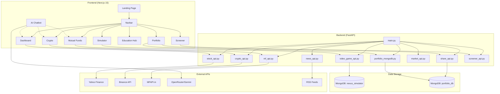

# NEXUS #

> **The Ultimate FinTech Playground — Trade, Learn, and Master the Markets**

NEXUS is a comprehensive fintech platform that combines **AI-powered insights**, **real-time portfolio tracking**, **paper trading simulation**, and **educational resources** to help investors make smarter financial decisions across **stocks**, **mutual funds**, and **cryptocurrencies**.


---

## Key Features

### Paper Trading Simulator
- **Risk-Free Trading:** Practice trading with virtual ₹10,00,000 starting capital
- **Real-Time Execution:** Buy, sell, short, and cover positions with live market prices
- **Stop-Loss Orders:** Set automatic sell triggers when prices drop below target
- **Limit Orders:** Place orders that execute when price conditions are met
- **Portfolio Tracking:** Real-time P&L, holdings value, and performance metrics
- **Order History:** Complete transaction log with fees and realized gains
- **Watchlist:** Track your favorite stocks with live price updates
- **Achievements System:** Earn badges for trading milestones and learning progress

### AI-Powered Investment Intelligence
- **AI Insights:** Personalized investment recommendations powered by **OpenRouter/Gemini** (configurable)
- **NexBôt Analysis:** Interactive AI chatbot for stock-specific analysis
- **AI Report Generation:** Auto-generated comprehensive investment reports with metrics
- **Smart Chatbot:** Financial assistant available across all pages

### Real-Time Market Dashboards
- **Stock Dashboard:** Live prices, % change indicators, and instant search
- **Crypto Dashboard:** Real-time cryptocurrency prices via **Binance API**
- **Mutual Funds:** NAV tracking with historical performance data
- **Market Indices:** Live NIFTY 50, SENSEX, NIFTY BANK, NIFTY IT tracking
- **Market Movers:** Top gainers and losers with real-time updates
- **Live Price Polling:** Automatic price refresh every 3-10 seconds during market hours
- **Weekend Data Support:** Historical data available even when markets are closed

### Advanced Analytics
- **Performance Heatmaps:** Visual monthly/yearly return breakdowns
- **Risk-Volatility Metrics:** Standard deviation, Sharpe ratio, and drawdown analysis
- **Monte Carlo Simulations:** Future price predictions with confidence intervals
- **Moving Averages:** 20-day and 50-day MA visualizations
- **Interactive Charts:** Zoomable, responsive charts with period selection (1M, 3M, 6M, 1Y)

### Stock Screener
- **Sector Filtering:** Filter stocks by sector (Banking, Technology, Energy, etc.)
- **Price Range Filters:** Set minimum and maximum price ranges
- **Change Percentage Filters:** Find stocks by daily % change
- **70+ Stocks:** NIFTY 50 + popular mid-cap stocks with real-time data
- **Parallel Data Fetching:** Fast loading with concurrent API calls

### Real-Time Financial News
- **RSS Feed Aggregation:** News from Economic Times, MoneyControl, Mint
- **Category Filtering:** Markets, Stocks, Economy, Global Markets
- **Date-Sorted Results:** Latest news first with proper date parsing
- **Fallback Content:** Always shows relevant content even if feeds fail

### Financial Education Hub
- **Courses & Tutorials:** Beginner-to-advanced modules on stocks, crypto, and mutual funds
- **Video & Blog Content:** Expert insights and interactive learning
- **Guided Learning Paths:** Progressive education for improving financial literacy
- **Financial Glossary:** Comprehensive dictionary of investment terms

### Secure Authentication
- **Auth0 Integration:** Enterprise-grade authentication and authorization
- **Personalized Portfolios:** Securely linked to user profiles
- **Data Protection:** Encrypted storage of user financial data

### Portfolio Sharing
- **Shareable Links:** Generate unique URLs to share your portfolio
- **View Counter:** Track how many times your share was viewed
- **Privacy Control:** Only you can delete your share links
- **No Auth Required:** Anyone with the link can view

---

## Tech Stack

### Frontend
| Technology        | Version | Purpose                           |
|-------------------|---------|-----------------------------------|
| **Next.js**       | 15.5.x  | React framework with App Router   |
| **React**         | 19.1.x  | UI component library              |
| **Tailwind CSS**  | 4.x     | Utility-first CSS styling         |
| **Recharts**      | 3.x     | Interactive charting library      |
| **Auth0**         | 4.x     | Authentication & user management  |
| **Framer Motion** | 12.x    | Smooth animations                 |
| **Lucide React**  | Latest  | Icon library                      |
| **Axios**         | 1.x     | HTTP client                       |

### Backend
| Technology        | Version | Purpose                           |
|-------------------|---------|-----------------------------------|
| **FastAPI**       | Latest  | High-performance Python REST API  |
| **Uvicorn**       | Latest  | ASGI server with hot reload       |
| **yfinance**      | Latest  | Yahoo Finance stock data          |
| **Pandas/NumPy**  | Latest  | Data analysis & calculations      |
| **MongoDB Atlas** | Latest  | Persistent storage for portfolio and simulator |
| **feedparser**    | Latest  | RSS feed parsing for news         |
| **pytz**          | Latest  | Timezone handling for market hours|

### External APIs
| API                          | Data Source                                   |
|------------------------------|-----------------------------------------------|
| **Yahoo Finance** (yfinance) | Stocks — prices, history, fundamentals        |
| **Binance API**              | Crypto — real-time prices, 24hr stats, klines |
| **MFAPI** (mfapi.in)         | Mutual Funds — NAV data, scheme details       |
| **OpenRouter/Gemini**        | AI — chatbot, analysis, report generation     |
| **RSS Feeds**                | News — Economic Times, MoneyControl, Mint     |

---

## Getting Started

### Prerequisites
- Node.js 18+
- Python 3.10+
- Auth0 account (for authentication)
- OpenRouter API key (for AI features) — optional

### Environment Variables

Create a `.env.local` file in the root directory:

```env
# API URL
NEXT_PUBLIC_API_URL=http://localhost:8000

# Auth0 Authentication
AUTH0_SECRET=<generate-a-long-random-string>
AUTH0_BASE_URL=http://localhost:3000
AUTH0_ISSUER_BASE_URL=https://your-tenant.auth0.com
AUTH0_CLIENT_ID=your_client_id
AUTH0_CLIENT_SECRET=your_client_secret

# OpenRouter AI (optional - for chatbot)
OPENROUTER_API_KEY=your_openrouter_api_key

# OR Gemini AI (alternative)
GEMINI_API_KEY=your_gemini_api_key
```

### Frontend Setup

```bash
# Install dependencies
npm install

# Run development server (with Turbopack)
npm run dev
```

### Backend Setup

```bash
# Navigate to backend directory
cd backend

# Create virtual environment (recommended)
python -m venv venv
source venv/bin/activate  # On Windows: venv\Scripts\activate

# Install Python dependencies
pip install -r requirements.txt

# Additional dependencies (may be needed)
pip install pytz python-dateutil feedparser numpy

# Run FastAPI server
uvicorn main:app --reload --port 8000
```

### MongoDB Setup (Portfolio + Simulator Persistence)

1. Create a MongoDB Atlas cluster (free tier works).
2. Create a database user and allow your IP in Network Access (or allow `0.0.0.0/0` for quick local testing).
3. Copy your SRV connection string from Atlas.
4. Create `backend/.env` from `backend/.env.example` and set:

```env
MONGODB_URI=mongodb+srv://<username>:<urlencoded-password>@<cluster>.mongodb.net/?retryWrites=true&w=majority&appName=NEXUS
```

5. Restart backend:

```bash
cd backend
uvicorn main:app --reload --port 8000
```

6. Verify it is connected:
- Startup log should show `MongoDB connection established successfully` and `MongoDB simulator database initialized successfully`.
- Portfolio API should respond without DB warnings:

```bash
curl http://localhost:8000/api/portfolio/test-user
```

Open [http://localhost:3000](http://localhost:3000) to view the application.

---

## Project Structure

```
nexus/
├── app/                          # Next.js App Router
│   ├── components/               # App-specific components
│   │   ├── Navbar.jsx           # Navigation bar
│   │   ├── Chatbot.jsx          # AI chatbot widget
│   │   ├── StockAIDostModal.jsx # AI analysis modal
│   │   ├── StockAIReportModal.jsx # AI report generator
│   │   └── EducationHub/        # Education components
│   ├── api/                      # Next.js API routes (Auth0)
│   │   └── auth/                # Auth0 handlers
│   ├── dashboard/                # Stock dashboard & detail pages
│   │   ├── page.js              # Stock listing with live prices
│   │   └── [symbol]/page.js     # Individual stock analysis
│   ├── crypto/                   # Crypto dashboard
│   │   ├── page.js              # Crypto listing
│   │   └── [symbol]/page.js     # Individual crypto analysis
│   ├── mf/                       # Mutual funds dashboard
│   │   ├── page.js              # MF scheme listing
│   │   └── [schemeCode]/page.js # Individual MF analysis
│   ├── simulator/                # Paper trading simulator
│   ├── screener/                 # Stock screener
│   ├── education/                # Learning hub
│   ├── Portfolio/                # User portfolio
│   ├── share/[shareId]/          # Shared portfolio viewer
│   └── profile/                  # User profile
├── components/                   # Shared components
│   ├── MarketIndices.jsx        # Live market indices
│   ├── MarketMovers.jsx         # Top gainers/losers
│   ├── HeroModern.jsx           # Landing page hero
│   └── ...
├── backend/                      # FastAPI backend
│   ├── main.py                   # FastAPI entry point
│   ├── stock_api.py              # Stock data endpoints
│   ├── crypto_api.py             # Crypto data (Binance)
│   ├── mf_api.py                 # Mutual fund endpoints
│   ├── video_game_api.py         # Trading simulator logic
│   ├── market_api.py             # Market indices & movers
│   ├── news_api.py               # Financial news RSS
│   ├── screener_api.py           # Stock screener endpoints
│   ├── share_api.py              # Portfolio sharing
│   ├── portfolio_mongodb.py      # Portfolio management (MongoDB)
│   └── simulator_mongodb.py      # Simulator storage layer (MongoDB)
├── lib/                          # Utility libraries
│   └── authClient.js             # Auth0 client hooks
└── public/                       # Static assets
```

---

## 🔗 API Endpoints

### Stock APIs
| Endpoint                             | Method | Description                             |
|--------------------------------------|--------|-----------------------------------------|
| `/api/stock/list`                    | GET    | Get list of popular stocks              |
| `/api/stock/quote/{symbol}`          | GET    | Get real-time quote                     |
| `/api/stock/fast-quote/{symbol}`     | GET    | Get fast quote with extended data       |
| `/api/stock/extended-quote/{symbol}` | GET    | Get detailed quote with 52-week data    |
| `/api/stock/history/{symbol}`        | GET    | Get historical price data               |
| `/api/stock/profile/{symbol}`        | GET    | Get company profile                     |
| `/api/stock/search-stocks?q=`        | GET    | Search stocks by name/symbol            |
| `/api/stock/risk-volatility/{symbol}`| GET    | Get risk & volatility metrics           |
| `/api/stock/monte-carlo-prediction/{symbol}` | GET | Get Monte Carlo predictions     |

### Market APIs
| Endpoint                             | Method | Description                             |
|--------------------------------------|--------|-----------------------------------------|
| `/api/market/indices`                | GET    | Get NIFTY 50, SENSEX, etc.              |
| `/api/market/movers`                 | GET    | Get top gainers and losers              |
| `/api/market/status`                 | GET    | Check if market is open                 |
| `/api/market/trending`               | GET    | Get trending/active stocks              |

### Screener APIs
| Endpoint                             | Method | Description                             |
|--------------------------------------|--------|-----------------------------------------|
| `/api/screener/stocks`               | GET    | Get stocks with filters                 |
| `/api/screener/sectors`              | GET    | Get list of available sectors           |

### News APIs
| Endpoint                             | Method | Description                             |
|--------------------------------------|--------|-----------------------------------------|
| `/api/news/latest`                   | GET    | Get latest financial news               |
| `/api/news/categories`               | GET    | Get news categories                     |

### Trading Simulator APIs
| Endpoint                                     | Method | Description                     |
|----------------------------------------------|--------|---------------------------------|
| `/api/simulator/portfolio/{user_id}`         | GET    | Get user portfolio              |
| `/api/simulator/buy`                         | POST   | Execute buy order               |
| `/api/simulator/sell`                        | POST   | Execute sell order              |
| `/api/simulator/short`                       | POST   | Open short position             |
| `/api/simulator/cover`                       | POST   | Close short position            |
| `/api/simulator/stop-order`                  | POST   | Create stop-loss order          |
| `/api/simulator/limit-order`                 | POST   | Create limit order              |
| `/api/simulator/watchlist/{user_id}`         | GET    | Get user watchlist              |
| `/api/simulator/orders/{user_id}`            | GET    | Get order history               |
| `/api/simulator/performance/{user_id}`       | GET    | Get trading performance stats   |

### Crypto APIs
| Endpoint                                     | Method | Description                     |
|----------------------------------------------|--------|---------------------------------|
| `/api/crypto/famous`                         | GET    | Get top cryptocurrencies        |
| `/api/crypto/coins?search=`                  | GET    | Search cryptocurrencies         |
| `/api/crypto/coin/{id}`                      | GET    | Get crypto details              |
| `/api/crypto/history/{id}`                   | GET    | Get price history               |

### Mutual Fund APIs
| Endpoint                                     | Method | Description                     |
|----------------------------------------------|--------|---------------------------------|
| `/api/mutual/search?q=`                      | GET    | Search mutual funds             |
| `/api/mutual/scheme-details/{code}`          | GET    | Get scheme details              |
| `/api/mutual/historical-nav/{code}`          | GET    | Get NAV history                 |

### Share APIs
| Endpoint                        | Method | Description                          |
|---------------------------------|--------|--------------------------------------|
| `/api/share/create/{user_id}`   | POST   | Create a new shareable link          |
| `/api/share/{share_id}`         | GET    | Get shared portfolio (public)        |
| `/api/share/list/{user_id}`     | GET    | List all your share links            |
| `/api/share/{user_id}/{share_id}` | DELETE | Delete a share link (owner only)   |

---

## Architecture Overview



### Data Flow
1. **Client Request** → Next.js App Router handles routing and renders React components
2. **API Calls** → Fetch requests to FastAPI backend on port 8000
3. **Data Fetching** → Backend fetches from external APIs (Yahoo Finance, Binance, MFAPI)
4. **Response** → JSON data returned to frontend for rendering
5. **Real-time Updates** → Polling intervals (3-10 seconds) for live price data during market hours

---

## Design Philosophy

NEXUS follows a **premium, modern fintech aesthetic** with these core principles:

### Visual Design
- **Dark Theme:** Professional dark backgrounds (#030014) with high contrast
- **Accent Colors:** Vibrant cyan/purple gradients for CTAs and highlights
- **Glassmorphism:** Subtle backdrop blur effects for depth
- **Typography:** Clean, readable fonts with proper hierarchy

### UX Principles
- **Progressive Disclosure:** Show essential info first, details on demand
- **Real-time Feedback:** Instant price updates and loading states
- **Responsive Design:** Mobile-first approach with adaptive layouts
- **Accessibility:** High contrast ratios and keyboard navigation

### Animation Guidelines
- **Subtle Transitions:** Smooth hover effects and page transitions (Framer Motion)
- **Loading States:** Skeleton screens and animated spinners
- **Micro-interactions:** Button feedback, card hovers, modal animations

---

## Known Limitations

| Limitation                      | Details                                      |
|---------------------------------|----------------------------------------------|
| **Market Hours**                | Indian market data available 9:15 AM - 3:30 PM IST |
| **Weekend Data**                | Historical data shown on weekends (last trading day) |
| **Rate Limits**                 | Yahoo Finance may throttle excessive requests |
| **Historical Data**             | Limited to available API history (usually 1-5 years) |
| **Paper Trading Only**          | No real money transactions                   |
| **Single Currency**             | Portfolio values in INR only                 |

---

## Simulator Features in Detail

### Order Types
| Type                | Description                                  |
|---------------------|----------------------------------------------|
| **Market Order**    | Buy/sell at current market price             |
| **Limit Order**     | Execute when price reaches target            |
| **Stop-Loss**       | Auto-sell when price drops below threshold   |
| **Short Selling**   | Profit from falling prices                   |

### Trading Fees
- **Transaction Tax:** 0.1% on all trades
- **Slippage:** ±0.05% market impact simulation

### Achievements
| Badge               | Requirement                     |
|---------------------|---------------------------------|
| First Trade      | Complete your first trade       |
| Diversified      | Hold 3+ different stocks        |
| Profit ₹1K       | Realize ₹1,000 in profits       |
| Short Master     | Profit from a short position    |
| Stop Loss Saved  | Have a stop-loss trigger        |

---

## Available Scripts

```bash
# Frontend
npm run dev      # Start dev server with Turbopack
npm run build    # Build for production
npm run start    # Start production server
npm run lint     # Run ESLint

# Backend
uvicorn main:app --reload --port 8000  # Development with hot reload
uvicorn main:app --host 0.0.0.0 --port 8000  # Production
```

---

## Deployment

### Frontend (Vercel)
1. Connect your GitHub repository to Vercel
2. Configure environment variables in Vercel dashboard
3. Deploy with automatic CI/CD

### Backend (Any Cloud)
```bash
# Production server (Railway, Render, AWS, etc.)
cd backend
pip install -r requirements.txt
uvicorn main:app --host 0.0.0.0 --port 8000
```

### Docker (Optional)
```dockerfile
# Backend Dockerfile
FROM python:3.11-slim
WORKDIR /app
COPY backend/requirements.txt .
RUN pip install -r requirements.txt
COPY backend/ .
CMD ["uvicorn", "main:app", "--host", "0.0.0.0", "--port", "8000"]
```

---

## Contributing

1. Fork the repository
2. Create a feature branch: `git checkout -b feature/amazing-feature`
3. Commit your changes: `git commit -m 'Add amazing feature'`
4. Push to the branch: `git push origin feature/amazing-feature`
5. Open a Pull Request

---

## License

This project is private and proprietary.

---

## Support

For support and questions:
- Open an issue on GitHub
- Contact the development team

---

**Built with  by Team Vectôr**
# NEXUS

# Nexus

